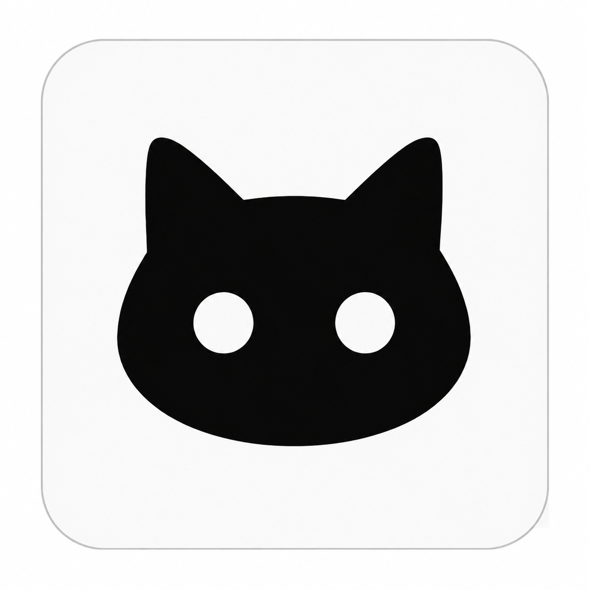
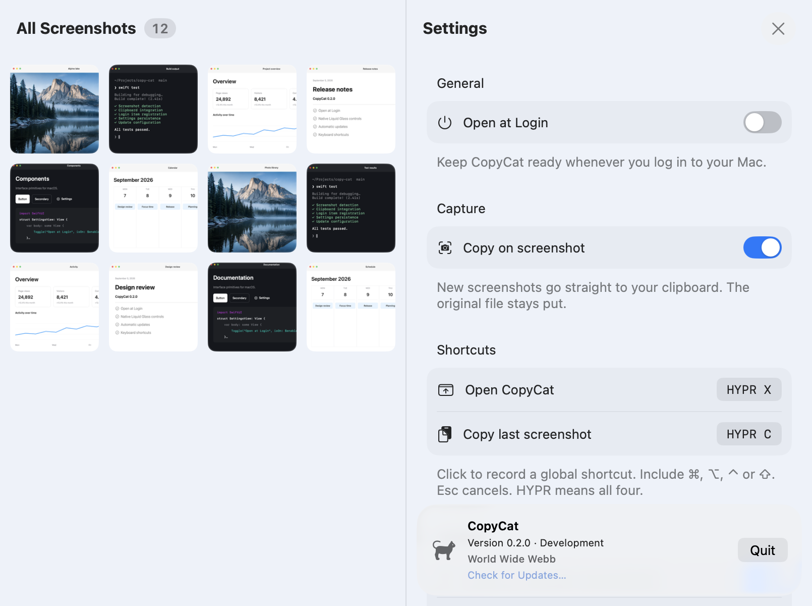

<div align="center">
  
  <h1>CopyCat</h1>
  <p><strong>Your screenshots. Already copied.</strong></p>
  <p>A native Mac utility that copies new screenshots to your clipboard<br>and keeps recent captures one click away.</p>
  <p><a href="https://0x63616c.github.io/copy-cat/">Website</a> · <a href="https://github.com/0x63616c/copy-cat/releases/latest">Download</a> · <a href="docs/install.md">Installation</a> · <a href="CONTRIBUTING.md">Contribute</a></p>
  <p><a href="https://github.com/0x63616c/copy-cat/actions/workflows/ci.yml"></a> <a href="https://github.com/0x63616c/copy-cat/releases"></a>  <a href="LICENSE"></a></p>
</div>

<p align="center"></p>

## Features

- **Screenshot → clipboard.** Take a screenshot as usual. Paste it straight into your next message or document.
- **A library in your menu bar.** Click a capture to copy it, hover for a larger preview, or reveal its file in Finder.
- **Ready after a restart.** Enable **Open at Login** in Settings. CopyCat uses macOS’s native login-item controls.
- **Your shortcuts.** Record global hotkeys for opening the library and copying the latest screenshot.
- **Local by design.** No account, subscription, analytics, or cloud image upload. Your files stay in their original folder.
- **Feels at home.** Liquid Glass controls on macOS 26, material fallbacks on older Macs, and system light/dark appearance.
- **Automatic updates.** Check for Updates in Settings, with optional background download and installation. Update archives and feeds are signed.
- **Native.** Swift, SwiftUI, AppKit, and the Sparkle update framework.

Made by **World Wide Webb**. Free and open source under the [MIT license](LICENSE). Updates use [Sparkle](https://sparkle-project.org/); its license and bundled component notices are included in the app’s Resources folder.

## Install

Requires **macOS 14 Sonoma or later**. Release downloads include **Apple Silicon and Intel**.

1. [Download the latest release](https://github.com/0x63616c/copy-cat/releases/latest/download/CopyCat-macOS.zip) and unzip it.
2. Move **CopyCat.app** into **Applications**, then open it.
3. Click the cat in your menu bar. Open **Settings → Open at Login** if you want it to start automatically.

**Community build notice:** GitHub builds are ad-hoc signed, not Apple-notarized. If macOS blocks the first launch and you trust the download, use **System Settings → Privacy & Security → Open Anyway**. See [installation and troubleshooting](docs/install.md), including Apple’s instructions and checksum verification.

## Using CopyCat

Use `⇧⌘3` or `⇧⌘4` to capture your screen. If macOS asks for access to your screenshot folder, grant it. CopyCat reads screenshots where macOS saves them; it never moves or deletes the originals.

| Action | How |
| --- | --- |
| Copy a recent screenshot | Click its tile in the menu bar library |
| Preview a screenshot | Hover over its tile |
| Reveal the original | Right-click a tile → Open in Finder |
| Open the library | Default: Hyper + X |
| Copy the latest capture | Default: Hyper + C |
| Change shortcuts | Settings → Shortcuts |
| Start automatically | Settings → General → Open at Login |
| Check for updates | Bottom of Settings → Check for Updates… |
| Configure automatic updates | Settings → Updates |
| Find your version or quit | Bottom of Settings |

**Hyper** means `⌃⌥⇧⌘` together. Every preference applies immediately. If macOS needs approval for startup, CopyCat shows an **Open Login Items…** button. Screenshots must be saved to files; CopyCat can help you change a clipboard-only screenshot destination.

## Build from source

Install **Xcode 26.2+** for the native Liquid Glass build (Swift 6+ with an older SDK builds the material fallback), then:

```sh
git clone https://github.com/0x63616c/copy-cat.git
cd copy-cat
swift test
./scripts/bundle.sh
cp -rf CopyCat.app /Applications/
open /Applications/CopyCat.app
```

For development, `./scripts/dev.sh` builds and relaunches the app from this checkout. Add `--release` for an optimized build or `--watch` to rebuild when HEAD changes. Quit your installed copy first to avoid duplicate menu bar icons.

## Project map

| Location | Responsibility |
| --- | --- |
| `Sources/CopyCatCore` | Settings, screenshot detection rules, layout logic, version |
| `Sources/CopyCatKit` | macOS services, app coordinator, SwiftUI interface |
| `Sources/CopyCat` | Executable entry point |
| `Tests` | Behavior tests and opt-in product screenshot rendering |
| `site` | Static GitHub Pages website and authentic product images |
| `scripts` | Build, packaging, website validation, release commands |

Read the [architecture guide](docs/architecture.md), [contributor guide](CONTRIBUTING.md), [release guide](docs/releases.md), and [agent instructions](AGENTS.md).

## Releases and contributions

A `vX.Y.Z` tag runs tests, builds a universal app, verifies its signature and architectures, and publishes a GitHub release with a ZIP, SHA-256 checksum, and signed Sparkle feed. The version is defined once in `Sources/CopyCatCore/Version.swift`; the bundle is stamped automatically. The website deploys independently when `site/` changes.

Found a bug or have a small improvement in mind? [Open an issue](https://github.com/0x63616c/copy-cat/issues) or send a pull request. Include your macOS version, CopyCat version, and steps to reproduce. Please remove personal screenshots and paths from reports.

Product images capture the actual native views with synthetic browser, dashboard, terminal, notes, and calendar content. The sample landscape was AI-generated; no private screenshots are used. Regenerate them with `COPYCAT_SCREENSHOTS=1 COPYCAT_SCREEN_CAPTURE=1 swift test --filter RenderSnapshots`.
